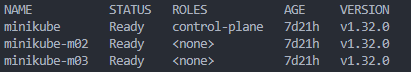
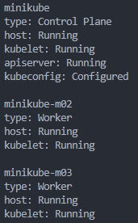
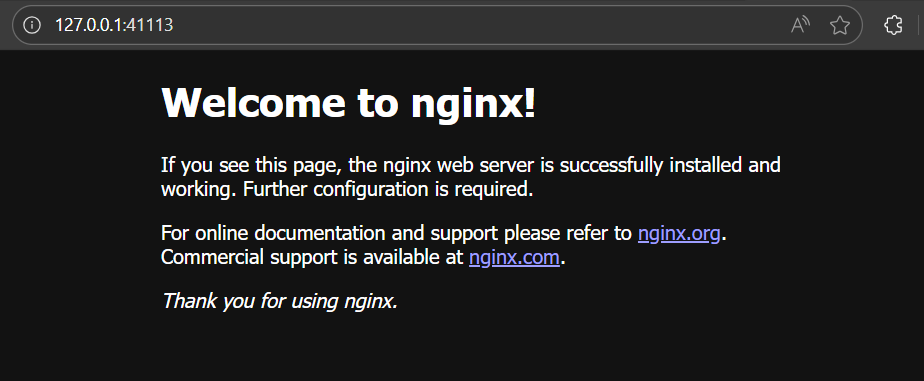

***Multi Node Cluster Setup in Single Ubuntu Machine using Minikube***
-
- Install minikube
    - *curl -LO https://storage.googleapis.com/minikube/releases/latest/minikube_latest_amd64.deb*
    - *sudo dpkg -i minikube_latest_amd64.deb*
- Check minikube installation
    - *minikube version*
    - *which minikube*
- If minikube has started its own cluster, let's delete that
    - *minikube delete*
- Create a multi-node cluster
    - *minikube start --node 3 --driver=docker*
- Verify the nodes
    - *kubectl get nodes*
    
    
    - *kubectl get nodes -o wide*
- Check cluster status
    - *minikube status*

        
- Testing pods scheduling across nodes
    - *kubectl create deployment nginx --image=nginx --replicas=3*
    - *kubectl get pods -o wide* (Run this command again in 10-20 seconds to see the changes)
- Create a service to expose the deployment
    - *kubectl expose deployment nginx --port=80 --type=NodePort*
    - *kubectl get services*
- Test the service:
    - *minikube service nginx --url*
    

***Next Steps***
- Test node failure simulation and recovery
- Inter-pod communication across nodes
- Persistent volumes
- Network policies
- Resource limits and scheduling
