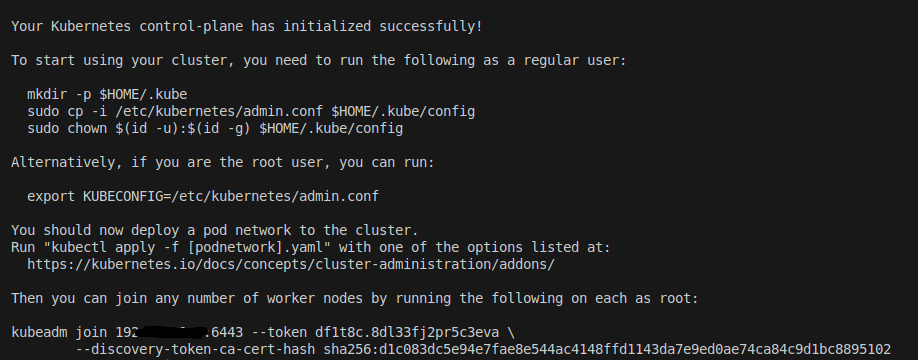
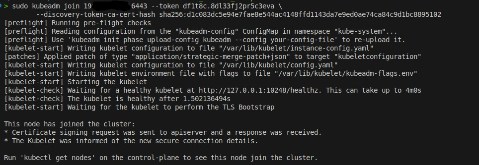
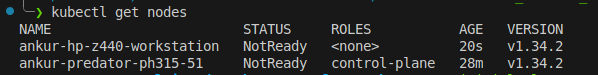

***Multi Node Cluster Setup in Two Ubuntu Machines***
-
**On Master Node**
- Install docker
- *sudo apt-get install -y apt-transport-https ca-certificates curl gnupg*
- Install kubectl
    - *curl -LO "https://dl.k8s.io/release/$(curl -L -s https://dl.k8s.io/release/stable.txt)/bin/linux/amd64/kubectl"*
- Install kubeadm kubelet and kubectl
    *sudo apt install -y kubelet kubeadm kubectl*
- *sudo kubeadm init*
    - This will create the master node / control-plane with a join command and token to add worker nodes

    

**On Worker Node**
- Repeat installation of docker and all the kubernetes packages
- Check connection with master node by pinging to its IP address
    - *ping -c 4 <Master Node machine IP address>*
    - If it fails the join command is likely to fail and the worker node will not be created
- Run the join command in root
- The node will join the cluster

    

**Back on Master Node**
- *kubectl get node*

    